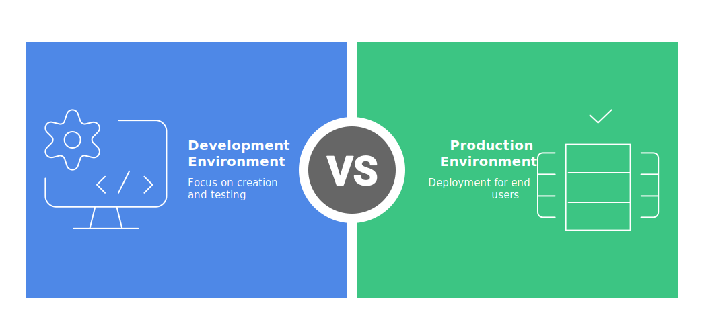

> - This is a human generated `README` with likely errors. 
> - This `README` file was not generated by an LLM. 
> - Although images in this README were generated using <napkin.ai> 

# A Java/Quarkus Chatbot using Elastic Search


This is a chat bot application demonstrating the use of Elastic Vector search capabilities together with Quarkus a blazing fast Java framework.

The Quarkus application ingests documents from storage, for which we use minio. It then stores the embeddings to Elastic search. Everytime a user makes a request asking a question, a similarity search is done on the Elastic Vector store. This way additional context is provided to the LLM. 

The project can be used in developement environment i.e. is the local developer machine or in production environment which in this case is the OpenShift platform.



## Development Environment Components

### Quarkus Java Application
Serves as the core application that processes ingested files and creates embeddings using the AllMiniLmL6V2EmbeddingModel from LangChain4J. Hosts the chatbot interface for user interaction.

### Elastic Search
Utilized for vector storage, allowing efficient searching and retrieval of embeddings.
Operated via `start-local` for local development.


### Minio
Acts as the object storage solution for storing the actual files ingested by the Quarkus application. Runs in a containerized environment for easy management. The docker file also has an intializer service that creates a bucket and loads the documents into it from the `.documents` dir. 


### LLM
A language model used for generating embeddings and enhancing the chatbot's capabilities. We use the Granite model. However if you wish its also possible to use OpenAI. see the `application.properties` file for more details. Comment the model URL and uncomment the OPENAI_API_KEY in that case. 

### Podman Desktop
The container management tool used to orchestrate the development environment, facilitating the deployment of the above components. We can use the Podman desktop AI extension to host the granite model. 


### How to run the dev environment
There are two ways to do this. The default docker compose-file resides in `deploy/`. however its experimental and does not have all the features enabled. especially Kibana. The second option is to use the official elastic cli which has all essentials loaded 

```bash
curl -fsSL https://elastic.co/start-local | sh
cd elastic-start-local
sh start.sh
```
 
After that run the docker-compose file to get the minio service started as well.

```bash
docker-compose -f deploy/docker-compose.yml up
```

This will bring up the local minio environment as well. 

once the services are started. head over to another terminal and run
```shell script
./mvnw compile quarkus:dev
```

now browse to `http://localhost:8080` and that should bring up the Chatbot. 

There are a bunch of personalities with skills etc in the `document/` directory. you can ask questions like. 
```
Who is AI Alex? 
or 
What happend when Spring boot Sally and ThreadLocal Theo went to dinner?
``` 

## Production Environment Components

### Quarkus Java Application
Similar to the development environment, it processes files and serves the chatbot interface.


### OpenShift
The platform for deploying the Quarkus application in a production setting, providing scalability and management features.

### OpenShift Image Registry
Used for storing and managing container images of the Quarkus application and other components. We use the Quarkus OpenShift extension to deploy to OpenShift.


### LLM
Continues to provide embedding generation and support for the chatbot in the production environment. We can use Granite-3B or OpenAI


### Elastic Search and Kibana
Deployed via operators for efficient management and monitoring of the search capabilities and data visualization.

### Minio Storage
Maintains the same role as in development, providing object storage for files in a production-ready manner.

The final deployed application should look something like below.

### To deploy
create a namespace/project called `elastic-vector`. The following guidelines assume that everything is deployed in this namespace.

Ensure the Elastic Operator is installed in OpenShift. the CR yaml files are in `deploy/openshift`

I have used the default Elastic and Kibana CRs. 
An example for each of them is in the deploy/openshift directory
- elastic-v9.yaml
- kibana-v9.yaml

Get the secret for logging into kibana and for application use later in this section

```bash
oc get secret elasticsearch-sample-es-elastic-user -n elastic-vector -o jsonpath='{.data}' | jq -r '.elastic | @base64d'
```

Next step is to instll minio

To deploy minio use the following yaml [minio.yaml](deploy/openshift/minio.yaml)  

Now lets get the access details
```bash
oc get secret minio-root-user -o jsonpath='{.data}' -n elastic-vector | jq

# Get the console url:
oc get route minio-console
```
Create a new bucket `elastic-bucket` and upload the file you would like to use for RAG. 


We also need to add these values to the app-secret which will be mounted by the running application container. 

```
kubectl create secret generic app-credentials --from-literal=quarkus.elasticsearch.password=ELASTIC_PASSWORD \
       --from-literal=minio.access-key=<MINIO_ROOT_PASSWORD> \
       --from-literal=minio.secret-key= <MINIO_ROOT_USER>\
       --from-literal=quarkus.langchain4j.openai.api-key=YOUR OpenAI key
```

So far so good. Lets setup the final piece before setting up the deployment.yaml i.e. ConfigMap
We need the config map to specify the application settings. 

The default configmap should work with OpenAI, if the key was provided in the `app-credentials` 

```yaml
  # assuming namespace for elastic is 'elastic-vector'
  quarkus.elasticsearch.hosts: 'elasticsearch-sample-es-internal-http.elastic-vector.svc.cluster.local:9200'
  quarkus.elasticsearch.ssl: 'true'
  quarkus.elasticsearch.username: elastic
  quarkus.langchain4j.timeout: 60s
  quarkus.elasticsearch.protocol: https
  quarkus.kubernetes-client.trust-certs: 'true'
  quarkus.kubernetes-config.secrets: app-credentials
  minio.endpoint: 'http://minio.elastic-vector.svc.cluster.local:9000'
  quarkus.http.port: '8080'
  quarkus.openshift.env.secrets: app-credentials
  quarkus.kubernetes-config.secrets.enabled: 'true'
  minio.bucket-name: elastic-bucket
  quarkus.websockets-next.server.auto-ping-interval: 1m
  quarkus.openshift.route.tls.termination: edge
```

Incase you are running this on OpenShift AI cluster and have your own Model hosted. Add the following properties to the [app-configmap.yaml](deploy/openshift/app-configmap.yaml) file.

```yaml
  quarkus.langchain4j.openai.chat-model.model-name: MODEL_NAME
  quarkus.langchain4j.openai.base-url: >-
    http://MODEL_SERVICE_ENDPOINT/v1
```


Under deploy/OpenShift there are additional application deployment files that need to be executed in the following order
- app-configmap.yaml
- app-secret.yaml
- deployment.yaml

```bash
oc apply -f deploy/openshift/app-configmap.yaml
oc apply -f deploy/openshift/deployment.yaml
```

Yay! Application should now be deployed and accessible via route. :) 

    > Note: Incase adding more documents for rag into the elastic-bucket, delete the pod, and it will ingest the new documents. 

If deploying via the source using the Quarkus OpenShift extension as follows

```bash
mvn clean compile package -Dquarkus.kubernetes.deploy=true -DskipTests
```

